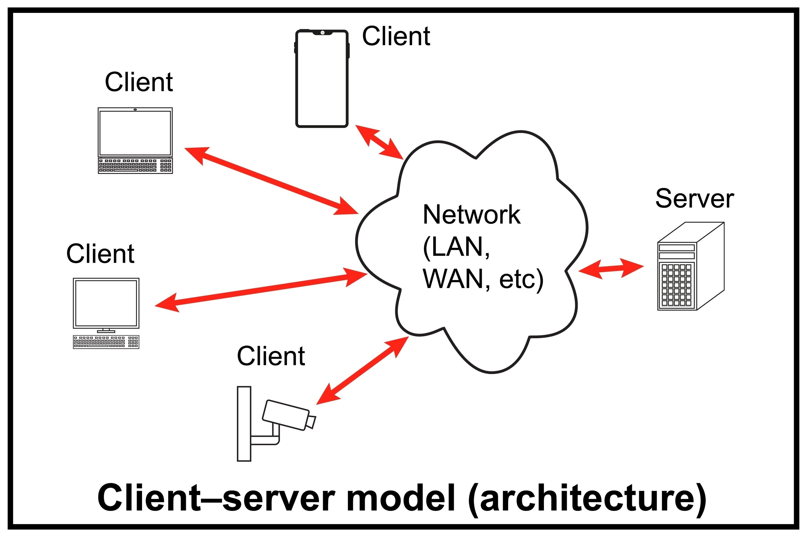

# Networking\_basics

### 🌐 OSI Model: Open Systems Interconnection

The OSI model is a conceptual framework that standardizes the functions of a telecommunication or computing system into seven distinct layers.

#### 💡 Mnemonic

> Please Do Not Throw Sausage Pizza Away _(Physical, Data Link, Network, Transport, Session, Presentation, Application)_

***

#### Layer 1: Physical

* Transmits raw bitstreams over physical mediums like cables, fiber, and connectors.
* Deals with electrical signaling and mechanical specifications rather than protocols.
* Common issues involve hardware failures like damaged wires or bad ports.

#### Layer 2: Data Link

* Provides node-to-node data transfer and manages physical MAC(media access control) addresses.
* Functions as the "Switching Layer" where frames are directed via hardware IDs.
* Acts as the foundation for communication over Ethernet and local networks.

#### Layer 3: Network

* Handles logical addressing and the routing of data packets across different networks.
* Operates primarily using the Internet Protocol (IP).
* Fragments frames to ensure they can traverse varying network infrastructures.

#### Layer 4: Transport

* Manages end-to-end communication, flow control, and error recovery between hosts.
* Utilizes TCP for reliable delivery and UDP for fast, connectionless transfer.
* Often referred to as the "Post Office" layer of the stack.

#### Layer 5: Session

* Coordinates the establishment, maintenance, and termination of connections between applications.
* Manages dialogue control to keep different data streams separate.
* Includes various control and tunneling protocols.

#### Layer 6: Presentation

* Responsible for character encoding, data compression, and application-level encryption.
* Ensures that data is in a readable format for the application layer to process.
* Is frequently integrated directly into the application layer in modern implementations.

#### Layer 7: Application

* Serves as the interface between the end-user and the network services.
* Supports protocols that enable software tasks like HTTP, FTP, and DNS.
* The only layer that interacts directly with user-facing software applications.

### Networking Devices

* **Router**\
  Connects different networks and sends data to the correct destination using IP addresses.
* **Switch**\
  Connects devices inside the same local network and sends data only to the correct device using MAC addresses.
* **Firewall**\
  A security system that allows or blocks network traffic based on rules.
* **IDS (Intrusion Detection System)**\
  Monitors network traffic and alerts when suspicious activity is detected.
* **IPS (Intrusion Prevention System)**\
  Detects and automatically blocks harmful network activity.
* **Server**\
  A computer that provides services or data to other computers (clients).
* **Proxy Server**\
  Acts as a middleman between a user and the internet. Can filter, cache, or hide requests.
* **NAS (Network Attached Storage)**\
  A storage device connected to a network so multiple users can access files.
* **SAN (Storage Area Network)**\
  A high-speed dedicated network that connects servers to storage systems.
* **Access Point (AP)**\
  A device that provides Wi-Fi access to wireless devices.

### Networking Functions

* **CDN (Content Delivery Network)**\
  A group of servers placed in different locations to deliver content faster to users.
* **VPN (Virtual Private Network)**\
  Creates a secure encrypted connection over the internet.
* **QoS (Quality of Service)**\
  Prioritizes important network traffic to improve performance.
* **TTL (Time To Live)**\
  A value in a packet that limits how many routers it can pass through before being discarded.
* **IP (Internet Protocol)**\
  The system used to identify devices and route data across networks.
* **DNS (Domain Name System)**\
  Converts domain names like `google.com` into IP addresses computers can understand.

### Types of Network

A **computer network** is a system of interconnected devices that communicate and share resources. Networks are broadly classified into several types based on their geographical scale and purpose.

* A **Personal Area Network (PAN)** is the smallest type, connecting devices within a few meters of a person, such as a smartphone paired with wireless earbuds via Bluetooth.&#x20;
* A **Local Area Network (LAN)** connects devices within a limited area like a home, office, or school building, offering high speed and low cost.&#x20;
* A **Metropolitan Area Network (MAN)** spans a city or large campus, typically used by organizations that need to connect multiple office locations across an urban area.&#x20;
* A **Wide Area Network (WAN)** covers vast geographical distances — the internet itself is the largest WAN in existence — linking cities, countries, and continents.&#x20;
* Finally, a **Wireless Local Area Network (WLAN)** is essentially a LAN that uses Wi-Fi instead of physical cables, offering mobility and flexibility within a defined space.

Each type serves a distinct purpose, and in practice, they often interconnect — for example, a home LAN connects to the broader internet (WAN) through an ISP.

### Types of Personal Data

**Personal data** refers to any information that relates to an identified or identifiable individual. It plays a central role in today's digital world, where data is constantly being collected, analyzed, and used by organizations. Personal data is generally categorized into three key types based on how it is generated or collected.

*   **Volunteered data** is information that individuals consciously and willingly provide. This includes details shared when filling out a registration form, posting on social media, writing a review, or entering personal information into an app. The individual is fully aware that they are sharing this data and does so intentionally.

*   **Observed data** is information that is passively collected by recording a person's behavior or activity, often without them actively providing it. Examples include browsing history tracked by websites, GPS location data recorded by a smartphone, purchase transactions logged by a retailer, or app usage patterns monitored in the background. The individual may be aware this data is being collected, but they do not directly hand it over.

* **Inferred data** is information that is derived or predicted about an individual based on analysis of their volunteered and observed data. For instance, a company might infer a person's income bracket from their spending habits, or predict health conditions from lifestyle patterns. This type of data is generated by the organization itself using algorithms and analytics — the individual never provided it directly.

### Bit

A **bit** is the most fundamental unit of data in computing and digital communications. Short for **binary digit**, it represents the smallest piece of information a computer can process. Everything a computer does — from displaying text to streaming video — ultimately comes down to the manipulation of bits. A bit can hold one of only two possible values, and the entire field of digital technology is built upon this simple concept.

**0 (Zero)** represents the "off" state in a binary system

**1 (One)** represents the "on" state in a binary system

Beyond a single bit, bits are grouped together to represent more complex data. Eight bits form a **byte**, which can represent 256 different values and is the standard unit used to measure file sizes and memory. Larger units such as kilobytes, megabytes, and gigabytes are all built upon this foundation.

### Common Methods of Data Transmission

After the data is transformed into a series of bits, it must be converted into signals that can be sent across the network media to its destination. Media refers to the physical medium on which the signals are transmitted. Examples of media are copper wire, fiber-optic cable, and electromagnetic waves through the air. A signal consists of electrical or optical patterns that are transmitted from one connected device to another. These patterns represent the digital bits (i.e. the data) and travel across the media from source to destination as either a series of pulses of electricity, pulses of light, or radio waves. Signals may be converted many times before ultimately reaching the destination, as corresponding media changes between source and destination.

There are three common methods of signal transmission used in networks:

* **Electrical signals -** Transmission is achieved by representing data as electrical pulses on copper wire.
* **Optical signals -** Transmission is achieved by converting the electrical signals into light pulses.
* **Wireless signals -** Transmission is achieved by using infrared, microwave, or radio waves through the air.

### Bandwidth

**Bandwidth** refers to the maximum theoretical capacity of a network connection — the highest amount of data that _can_ be transmitted over a channel in a given period of time. It is measured in bits per second (bps), megabits per second (Mbps), or gigabits per second (Gbps). Think of bandwidth as the width of a highway — a wider road has more lanes and can theoretically accommodate more traffic at once. It represents potential, not actual performance.

#### Throughput

**Throughput**, on the other hand, refers to the actual amount of data successfully transmitted over a network in a given period of time. It is what you experience in reality, and it is almost always lower than the bandwidth due to factors such as network congestion, packet loss, latency, hardware limitations, and transmission errors. Using the same highway analogy, throughput is the number of cars that actually reach their destination — accounting for traffic jams, accidents, and slowdowns along the way.

### Clients and Servers

#### Roles

#### The Client

The client is the device or application that requests information or services.

* Examples: Your web browser (Chrome, Safari), a mobile app like Instagram, or your smart TV.
* Role: It provides the user interface, takes your input (like clicking a link), sends a request across the network, and displays the response you get back.

#### The Server

The server is a powerful computer or cluster of computers that delivers data or services to the clients.

* Examples: Google’s search database, Netflix's video storage, or an email host.
* Role: It constantly listens for incoming requests from clients. When a request arrives, the server processes it, fetches the necessary data, and sends it back to the client.

<figure><figcaption></figcaption></figure>

### Peer-to-Peer Networks

Unlike the client-server model, where a central computer does all the heavy lifting, a Peer-to-Peer (P2P) network is a decentralized structure where every computer on the network is an equal.

In a P2P network, there is no dedicated server. Instead, every connected computer is called a peer.

#### How P2P Works

In this setup, each peer acts as both a client and a server at the same time.

* As a Client: A peer can request files or data from other computers on the network.
* As a Server: A peer shares its own processing power, disk storage, or bandwidth, allowing other computers to download files directly from it.

<figure><figcaption></figcaption></figure>

#### Key Characteristics of P2P

* Decentralized: There is no single point of control. If one computer goes offline, the rest of the network keeps working perfectly.
* Highly Scalable: The network actually gets _stronger_ and faster as more people join, because every new user adds more resources to share.
* Common Examples: File-sharing networks (like BitTorrent), blockchain and cryptocurrencies (like Bitcoin), and certain VoIP services (like early versions of Skype).

### Network Infrastructure

Network infrastructure is the underlying hardware and software resources that enable network connectivity, communication, operations, and management of an enterprise network. Think of it as the digital highway system of the modern world—it provides the paths, signals, and rules that allow data to travel safely and quickly from point A to point B.

A typical network infrastructure is built from three main components:

#### 1. Hardware

These are the physical, tangible devices you can touch. They form the literal backbone of the network.

* Routers: The traffic cops that connect different networks together and direct data packets along the most efficient paths.
* Switches: The internal hubs that connect devices (like computers, printers, and servers) within the same local network.
* Cables and Access Points: Fiber-optic cables, Ethernet wires, and Wi-Fi routers that physically transmit data.

#### 2. Software

Without software, the hardware is just expensive metal. This layer manages and secures the data flow.

* Operating Systems: Network OS (like Cisco IOS) that run routers and switches.
* Protocols and Firewalls: Security software and rules (like TCP/IP) that protect the network from unauthorized access and ensure data is packaged correctly.

#### 3. Services

These are the background functions that make the network usable for humans.

* IP Addressing (DHCP): Automatically assigning a digital "home address" to every device that connects.
* Domain Name Resolution (DNS): The phonebook of the internet that translates human-friendly URLs (like google.com) into computer-friendly IP addresses.

### End Devices

The network devices that people are most familiar with are called end devices, or hosts. These devices form the interface between users and the underlying communication network.

Some examples of end devices are as follows:

* Computers (workstations, laptops, file servers, web servers)
* Network printers
* Telephones and teleconferencing equipment
* Security cameras
* Mobile devices (such as smart phones, tablets, PDAs, and wireless debit/credit card readers and barcode scanners)

An end device (or host) is either the source or destination of a message transmitted over the network, as shown in the animation. In order to uniquely identify hosts, addresses are used. When a host initiates communication, it uses the address of the destination host to specify where the message should be sent.

### Wireless Networks

Wireless networks are computer networks that use radio frequency (RF) connections to connect devices, eliminating the need for physical cables. They allow smartphones, laptops, and smart devices to communicate and share data over the air, providing mobility and flexibility.

Depending on their range, speed, and purpose, wireless networks are categorized into different types. Here is a breakdown of the most common ones you use every day:

#### 1. Wireless Personal Area Networks (WPAN)

These are short-range networks designed to connect personal devices within a small space, usually within arm's reach or a single room.

* Bluetooth: Best for short-range audio streaming, file sharing, and connecting peripherals (like wireless earbuds, mice, and smartwatches). It operates efficiently over short distances with low power consumption.
* NFC (Near Field Communication): An ultra-short-range technology (usually requiring devices to be within a few centimeters of each other). It is the backbone of contactless mobile payments like Apple Pay or Google Wallet, and quick data transfers between phones.

#### 2. Wireless Local Area Networks (WLAN)

These networks cover a medium distance, typically inside a home, office, or school.

* Wi-Fi: The most ubiquitous wireless technology. It connects local devices to each other and to the internet through a central wireless router or access point. It offers high data speeds but requires devices to stay within a few hundred feet of the router.

#### 3. Wireless Wide Area Networks (WWAN)

These networks cover massive geographic areas, such as entire cities, countries, or even the globe.

* Cellular Networks (4G/5G): Provided by telecommunications companies using cellular towers. This is what gives your phone internet access on the go, allowing you to stream videos or browse the web from almost anywhere.
* GPS (Global Positioning System): While technically a one-way space-based navigation system rather than a two-way communication network, GPS uses a constellation of satellites to beam signals down to your device. Your phone calculates these signals to determine your exact location anywhere on Earth.

#### Summary Table

| **Technology** | **Typical Range** | **Primary Use Case**                           |
| -------------- | ----------------- | ---------------------------------------------- |
| NFC            | Centimeters       | Contactless payments, tap-to-pair              |
| Bluetooth      | \~10 meters       | Connecting headphones, smartwatches, keyboards |
| Wi-Fi          | \~50–100 meters   | Home and office internet browsing              |
| Cellular (5G)  | Kilometers        | Mobile internet while traveling                |
| GPS            | Global            | Maps, navigation, and tracking                 |

### The Internet and Standards

With the increasing number of new devices and technologies coming online, how is it possible to manage all the changes and still reliably deliver services such as email? The answer is internet standards.

A standard is a set of rules that determines how something must be done. Networking and internet standards ensure that all devices connecting to the network implement the same set of rules or protocols in the same manner. Using standards, it is possible for different types of devices to send information to each other over the internet. For example, the way in which an email is formatted, forwarded, and received by all devices is done according to a standard. If one person sends an email via a personal computer, another person can use a mobile phone to receive and read the email as long as the mobile phone uses the same standards as the personal computer.

### Network Protocols

Think of network protocols as the digital languages and rulebooks of the internet. Without them, gadgets might be able to physically connect to each other, but they wouldn't have a clue how to actually communicate.

#### What is a Network Protocol?

A network protocol is a standardized set of rules, formats, and procedures that govern how data is transmitted and received across a network. They ensure that whether you are using an iPhone, a Windows laptop, or a smart fridge, your devices can seamlessly exchange data regardless of their manufacturer or internal software.

#### The Core Functions

Protocols work behind the scenes to handle several critical tasks:

* Data Formatting: Breaking large chunks of data (like a video file) into smaller, manageable pieces called packets.
* Routing: Ensuring these packets find the most efficient path to their destination.
* Error Recovery: Checking if any packets were lost or corrupted during transit and asking for them to be resent.

#### Common Examples You Use Every Day

| **Protocol** | **What it Stands For**                            | **What it Does**                                                                                                     |
| ------------ | ------------------------------------------------- | -------------------------------------------------------------------------------------------------------------------- |
| HTTP / HTTPS | Hypertext Transfer Protocol (Secure)              | Loads webpages. The "S" version encrypts the data for security.                                                      |
| TCP / IP     | Transmission Control Protocol / Internet Protocol | The fundamental "backbone" of the internet that connects devices and guarantees reliable data delivery.              |
| DNS          | Domain Name System                                | The internet's phonebook. It translates human-friendly URLs (like `google.com`) into computer-friendly IP addresses. |
| SMTP / IMAP  | Simple Mail Transfer / Internet Message Access    | The protocols responsible for sending and retrieving emails.                                                         |

If a network protocol is a single rulebook, a protocol stack is the entire library.

In the real world, no single protocol can handle everything required to send data across the globe. Instead, multiple protocols work together, stacked on top of each other in a specific hierarchy.

#### What is a Protocol Stack?

A protocol stack (also known as a protocol suite) is a prescribed hierarchy of software layers that work together to enable network communication. Each layer in the stack has a dedicated job and uses specific protocols to accomplish it.

When you send data, it moves down the stack, with each layer adding its own necessary information. When the data arrives at its destination, it moves up the stack, stripping that information back off.

#### The Two Main Models

Network engineers generally refer to two conceptual models to understand how these stacks are structured:

1. The TCP/IP Model (The Practical Stack): This is the actual architecture that powers the modern internet. It is typically broken down into 4 layers:
   * Application Layer: Where you interact with the network (e.g., HTTP for web browsers, SMTP for email).
   * Transport Layer: Ensures data gets from point A to point B reliably (e.g., TCP, UDP).
   * Internet Layer: Handles the routing and addressing of data packets across different networks (e.g., IP).
   * Network Access Layer: The physical hardware and data-link protocols that actually move bits over wires or Wi-Fi (e.g., Ethernet, Wi-Fi).
2. The OSI Model (The Theoretical Stack): A more detailed, 7-layer theoretical model used primarily for teaching and troubleshooting. It breaks the process down even further into Physical, Data Link, Network, Transport, Session, Presentation, and Application layers.

#### How It Works: The Assembly Line Analogy

Think of a protocol stack like a factory assembly line preparing a package for shipping:

* Application Layer: You write a letter and put it in an envelope.
* Transport Layer: The factory seals the envelope and writes a tracking number on it so it doesn't get lost.
* Internet Layer: The shipping department pastes the destination address and return address on the outside of the box.
* Network Access Layer: The box is loaded onto a delivery truck and driven down the highway.

### TCP/IP

The TCP/IP model is the foundational blueprint of the modern internet. Created in the 1970s by the U.S. Department of Defense, it is a practical, four-layer framework that dictates exactly how data is packaged, addressed, sent, and received across a global network of diverse devices.

* Application Layer: Interacts directly with user software to initiate communication via familiar protocols like HTTP for web browsing or SMTP for email.
* Transport Layer: Manages host-to-host communication by slicing data into segments and deciding whether to send them reliably (TCP) or rapidly (UDP).
* Network (or Internet) Layer: Packages segments into packets and uses IP addresses to route them across different networks to their ultimate destination.
* Network Access Layer: Converts data packets into hardware-readable frames and physically transmits them as raw bits (1s and 0s) over Wi-Fi, Ethernet, or fiber-optic cables.

### TCP/IP vs OSI

<figure><figcaption></figcaption></figure>

